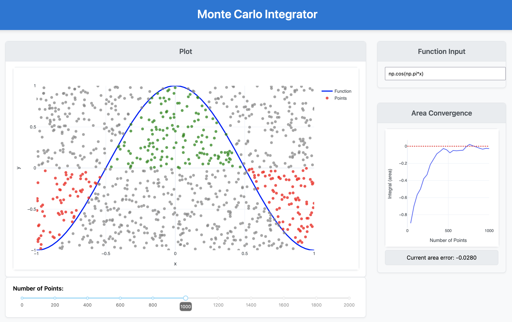

# monte-carlo-integration

Python web app built using Plotly and Dash to visualise the process of stochastic integration via Monte Carlo method. Suppose you have a function $f(x)$ over an interval. The area under the curve can be computed by randomly throwing points onto the plane, and recording that fraction of points lie between the curve and the x-axis, accounting for the area sign. As more and more points are sampled, the accuracy of this method increases. 

## App
The user can define a function (using Python + NumPy mathematical expression syntax) over an interval $x \in [-1, 1]$ and $y \in [-1, 1]$. The slider below the plotted function allows the user to throw an increasing number of points onto the chart, visualising their contributions to estimating the function's definite integral between -1 and 1.

A smaller graph on the right of the page will show how the Monte Carlo estimated area converges to the actual area (computed via trapezium method) as the number of points varies.

This app plots the graph on a square with total area of 4 length units squared. The net proportion of positive area points is therefore multiplied by 4 to get the area estimate.

## App Structure

- `app.py` creates server and sets constants used throughout the app
- `layout.py` creates HTML skeleton, you can modify slider properties and limits here
- `app_updater.py` contains the app's `callback` (updater) function. All logic for random point sampling, estimating area and trapezium rule integration
- `run.py` starts the web app locally

## Requirements
This project was made with:

- `dash==3.0.1`
- `plotly==6.0.1`
- `numpy==1.26.4`